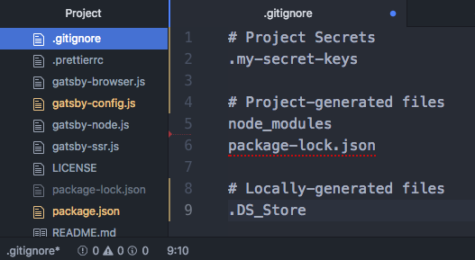

# gitignore

### Projected Time

Example: 30-45 minutes

### Prerequisites

Here are links to lessons that should be completed before this lesson:

- [Git version control](version-control/git-version-control/git-version-control.md)

### Motivation

Adding certain files to gitignore will prevent staging and committing those files, protecting your private info like keys, passwords, and other secrets. It's also useful to exclude very large or locally generated files from being saved unnecessarily.

### Objectives

**Participants will be able to:**

- Add unwanted files to their .gitignore
- Know what data to protect
- Know what files don't need to be committed

### Specific Things To Teach

- Things about the things
- More things about the things
	- This is a sub-thing about the things
- Even more things about the things
- Even more things about the things

### Materials

- [Example website](example.com)
- [Other example website](otherexample.com)

### Lesson



Here's text about introducing something and how it works.

Build on the first information. Have apprentices guess things, do an activity, etc.

Make sure to mention these things:

- Things
	- This is a sub-thing
- More things
- Even more things
- Even more things


### Common Mistakes / Misconceptions

List things that apprentices might not realize, might assume at first, or should avoid.

- Example
- Example


### Guided Practice
1. On your command line, navigate to your project's root folder.

2. enter:
```
touch .gitignore
```
3. if you don't yet have a .env, also enter:
```
touch .my-secret-keys
git status
```
You should see both files as an untracked in git. Don't add or commit anything yet, though.

4. open .gitignore in your text editor:
```
atom .gitignore  //or
code .gitignore
```

5. add this text to your file:
```
# Project Secrets
.my-secret-keys
# Project-generated files
node_modules
package-lock.json
# Locally-generated files
.DS_Store
```

6. You should see the text of your ignored files darken in your IDE's tree view.

7. Go back you your command line and type:
```
git status
```
You should no longer see .env in your untracked files, because git is ignoring it!

8. Go ahead and add and commit your .gitignore file.

### Independent Practice

Class does this thing themselves with specific additional items.


### Challenge

Apprentices can try to do this other thing.


### Check for Understanding

Some ideas: have apprentices summarize to each other, make a cheat sheet, take a quiz, do an assignment, or something else that helps assess their understanding.
